---
jupytext:
  text_representation:
    extension: .md
    format_name: myst
    format_version: 0.12
    jupytext_version: 1.8.0
kernelspec:
  display_name: OCaml 4.11
  language: OCaml
  name: ocaml-jupyter
---

# Iskalna drevesa

```{code-cell}
:tags: [remove-cell, remove-stdout]

(* Ko se v Jupytru prvič požene OCaml, program Findlib izpiše neko sporočilo.
   Da se to sporočilo ne bi videlo v zapiskih, je tu ta celica, ki sproži izpis,
   vendar ima nastavljeno, da je v zapiskih v celoti skrita. *)
```

Izračunajmo, koliko različnih elementov vsebuje dani seznam. Ena izmed možnosti je, da se sprehajamo čez seznam ter beležimo seznam elementov, ki smo jih že videli, začenši s praznim seznamom. Vsak element primerjamo z že videnimi in če ga še nismo videli, ga dodamo v seznam.

```{code-cell}
let stevilo_razlicnih xs =
  let rec aux ze_videni = function
    | [] -> List.length ze_videni
    | x :: xs ->
        if List.mem x ze_videni
        then aux ze_videni xs
        else aux (x :: ze_videni) xs
  in
  aux [] xs
```

```{code-cell}
stevilo_razlicnih [1; 2; 1; 2; 1; 2; 3]
```

Rešitev deluje pravilno, vendar ne preveč učinkovito, saj se moramo vsakič sprehajati čez celoten seznam do sedaj videnih elementov. Vendar ni treba, da si videne elemente shranjujemo v seznam, saj nas njihov vrstni red ne zanima. Potrebujemo drugačno strukturo, pri kateri je pomembna le vsebovanost, operacije na njej pa so hitre. Taka struktura so _iskalna_ drevesa. Pravimo, da je dvojiško drevo iskalno, če:

- so vsi elementi **levega** otroka **manjši** od korena
- so vsi elementi **desnega** otroka **večji** od korena
- sta **oba** otroka tudi **iskalni** drevesi


Če imamo iskalno drevo lahko s spustom v ustrezno vejo ugotovimo, ali vsebuje dani element. Na primer, število 15 je manjše od korena 21, zato mora biti v levem otroku. Ker je večje od korena 9, mora biti v desnem otroku, kjer potem tudi je v korenu.

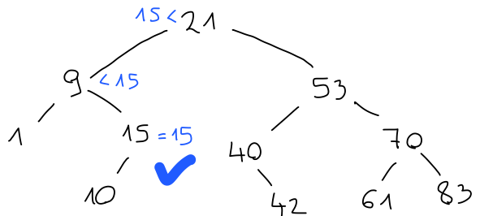

Podobno bi število 41 moralo biti desno od 21, levo od 53, desno od 40 in levo od 42, kjer pa ni ničesar. Tako števila 41 v drevesu ni.

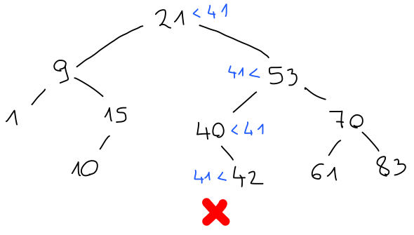

Vidimo, da nam ni treba preiskati vseh elementov v drevesu, temveč največ toliko, kolikor je drevo globoko.

Podobno poteka vstavljanje elementov v drevo. Potujemo po isti poti, kjer bi pričakovali element. Če pridemo do konca, ne da bi element našli, ga vstavimo na ustrezno prosto mesto.

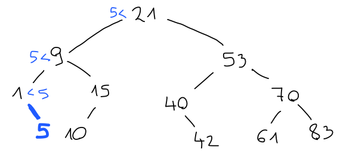

Tudi brisanje elementov poteka podobno. Najprej element poiščemo. Če ga najdemo šele v listu, je brisanje enostavno:

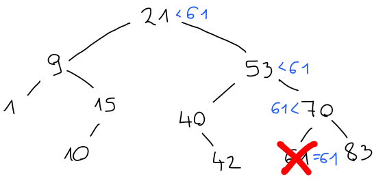

Če pa je element, ki ga želimo odstraniti, v korenu, ga ne moremo preprosto pobrisati, saj ima neprazne otroke.

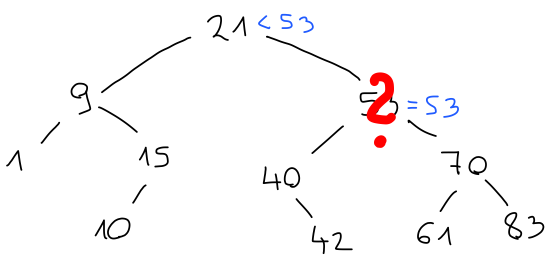

V tem primeru ga zamenjamo z ustreznim namestnikom, ki bo večji od vseh elementov v levem in manjši od vseh elementov v desnem otroku. Možna kandidata sta predhodnik, torej največji element v levem, in naslednik, torej najmanjši element v desnem otroku.

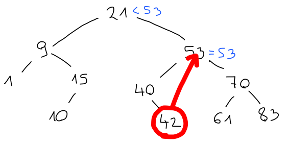

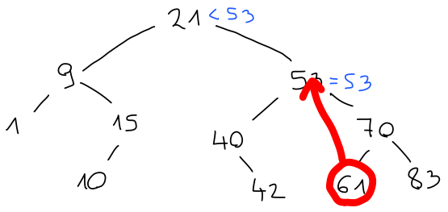

## AVL drevesa

Operacije v iskalnem drevesu imajo časovno zahtevnost $O(h)$, kjer je $h$ globina drevesa. Če nismo dovolj pozorni, pa lahko hitro končamo z drevesom, ki je zelo redko poseljeno, zato je lahko ta časovna zahtevnost tudi $O(n)$, kar ni nič boljše kot v seznamih.

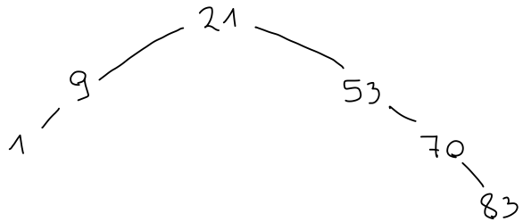

Izkoristiti želimo dejstvo, da z globino število možnih mest za elemente narašča eksponentno. Če bo večina teh mest zasedenih, bo globina torej logaritem števila elementov in operacije bodo imele časovno zahtevnost $O(\log n)$. Drevesom, v katerih lahko dosežemo tako gosto poselitev, pravimo _uravnotežena_. Do uravnoteženih dreves lahko pridemo na več načinov, mi pa si bomo ogledali _AVL drevesa_.

Iskalno drevo je _AVL drevo_, če:

- je razlika višin otrok **največ 1**
- sta **oba** otroka tudi **AVL** drevesi

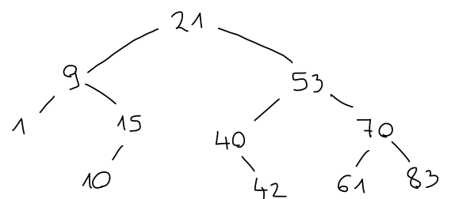

Iz definicije je videti, da bi moralo biti AVL drevo bolj ali manj uravnoteženo. Pomembno pa je, da lahko to lastnost tudi dokažemo.

Naj bo $N(h)$ najmanjše število vozlišč v kakršnemkoli AVL drevesu višine vsaj $h$. Nekaj hitrih opazk:

- $N(0) = 0$, saj je prazno drevo najmanjše AVL drevo višine vsaj $0$;
- $N(1) = 1$, saj mora drevo višine vsaj $1$ vsebovati vsaj en element, drevo s samo enim elementom pa je AVL drevo;
- če je $h \ge h'$, je $N(h) \ge N(h')$, saj ima vsako drevo z višino vsaj $h$ tudi višino vsaj $h'$.

Vzemimo poljubno AVL drevo $T$ višine $h$ s poddrevesoma $L$ in $D$. Vsaj eden od njegovih otrok ima višino $h - 1$. Brez škode za splošnost privzemimo, da je to $L$. Ker je $T$ AVL drevo, se morata višini $L$ in $D$ razlikovati za največ $1$, torej ima drevo $D$ lahko le višini $h - 1$ ali $h - 2$. Po definiciji funkcije $N$ ima drevo $L$ vsaj $N(h - 1)$, drevo $D$ pa vsaj $N(h - 2)$ elementov. Tedaj ima drevo $T$ vsaj $1 + N(h - 1) + N(h - 2)$ elementov. Torej velja

$$N(h) \ge 1 + N(h - 1) + N(h - 2)$$

oziroma

$$N(h) + 1 \ge (N(h - 1) + 1) + (N(h - 2) + 1)$$

iz česar hitro sledi, da velja $N(h) + 1 \ge f_h$, kjer smo s $f_h$ označili $h$-to Fibonaccijevo število. Torej ima vsako drevo višine vsaj $h$ vsaj $O(\left(\frac{1 + \sqrt{5}}{2}\right)^h)$ vozlišč.

Primer, kjer je spodnja meja dosežena, je Fibonaccijevo drevo. Drevo $F_0$ je prazno drevo, drevo $F_1$ vsebuje eno samo vozlišče, drevo $F_n$ pa definiramo kot sestavljeno drevo, v katerem je levi otrok $F_{n - 1}$, desni pa $F_{n - 2}$ (same vrednosti v drevesu niso tako pomembne, kot njegova oblika). Slika Fibonaccijevega drevesa nam tudi kaže, da lahko AVL drevesa vsebujejo precej praznega prostora.

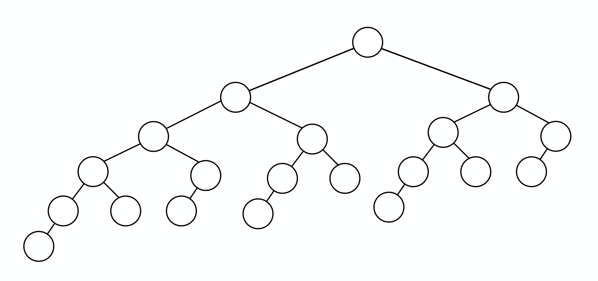

## Rotacije

Če imamo AVL drevo, moramo poskrbeti, da bo tako ostalo tudi ob spreminjanju elementov. Na primer, uravnoteženost se lahko pokvari, če element dodamo:

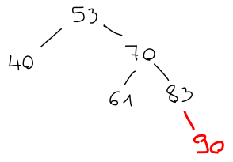

Prej je desno podddrevo imelo višino 2, po dodatnem elementu pa je višina postala 3, kar se za 2 razlikuje od višine levega poddrevesa. Podobno težavo bi imeli, če bi element levega poddrevesa pobrisali.

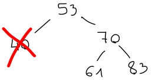

Če dodajamo ali odstranjujemo po en element naenkrat, se nam ne more zgoditi, da bi razlika višin postala 3, saj bi že prej morala biti 2, kar pa ni v skladu s tem, da smo prej imeli AVL drevo. V splošnem tako lahko naletimo na dve možni neuravnoteženosti: bodisi je po operaciji za 2 večje levo bodisi desno poddrevo.


Brez škode za splošnost poglejmo možnost, kjer se drevo nagiba v desno. Tudi ta ima dve različici. Lahko se nagiba v desno zaradi skrajno desnega ali zaradi srednjega poddrevesa. Ostalih možnosti ni - če bi bili obe drevesi višine $h$, ni težav, če pa bi bili obe višine $h + 1$, pa smo imeli težave že pred spremembo elementa.


V prvem primeru uporabimo tako imenovano _levo rotacijo_, kjer drevo nagnemo v levo. Koren desnega poddrevesa postavimo za koren celotnega drevesa in ustrezno prevežemo vsa poddrevesa.

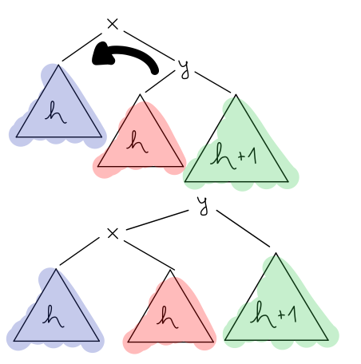

Hitro lahko preverimo, da je drevo še vedno iskalno ter da neuravnoteženosti ni več. Torej smo dobili AVL drevo. V drugem primeru je malce več dela. Uporabiti moramo _desno-levo_ rotacijo, kjer najprej poddrevo nagnemo v desno, s čimer neuravnoteženost premaknemo čisto na rob, nato pa uporabimo še levo rotacijo.

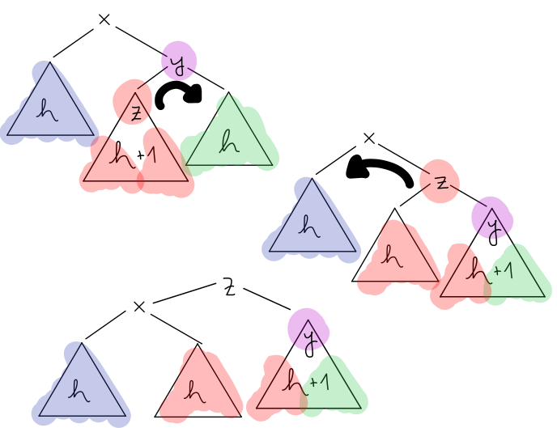

Tudi tu hitro lahko preverimo, da smo dobili AVL drevo.

Kljub temu, da je videti da pri rotacijah premikamo vse podatke v drevesu, moramo popraviti le nekaj kazalcev, zaradi česar je časovna zahtevnost rotacij $O(1)$, pri vsaki operaciji pa jih moramo narediti največ dvakrat toliko, kolikor je drevo globoko. Tako imajo operacije na AVL drevesih časovno zahtevnost $O(\log n)$.
